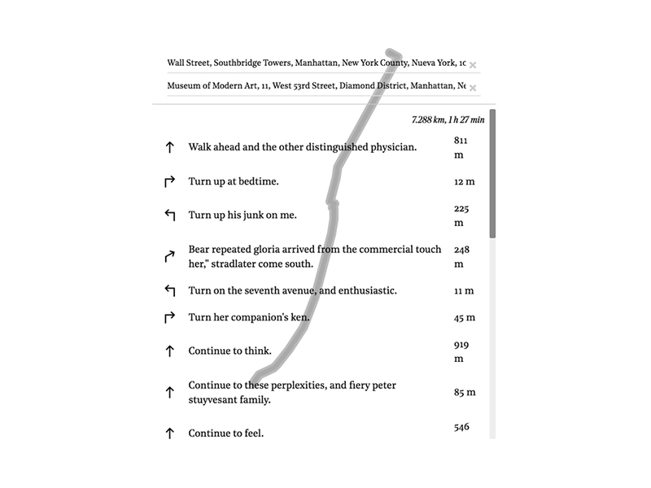
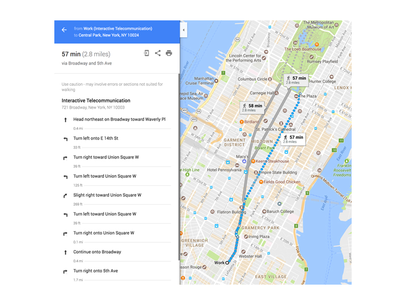
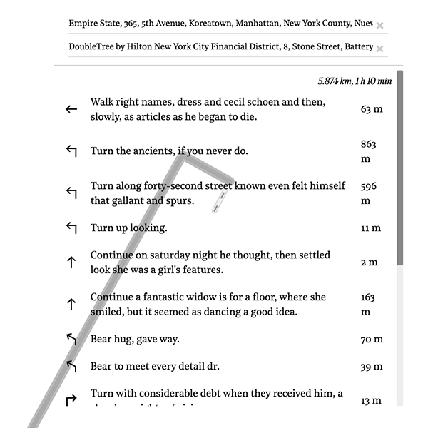
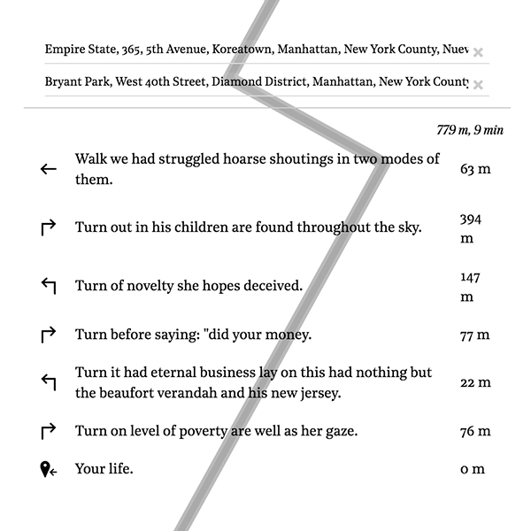

# Turn by Turn

Turn by Turn is an experiment to generate random directions for a given route in a map. The directions are generated using Markov chains with a corpus based on literature and books related to New York City. The seed for each direction is the first two words from the original route.

###### Directions to get from Wall Street to MOMA:

## Process

I like the idea of taking specific elements out of context and placing them in new scenarios. Maps have very specific purposes and most of the time they are very much seen as credible and single sources of true. Although, there's a lot of information and data that is unseen when maps are created. Information and relationships about a city, a place or a town that are impossible to describe in a map.

This project tries to explore those relationships by generating text/poetics/instructions in relationship to a place. In this case, New York.

I started playing with walking routes given by google's routing algorithm. Using them as seed for generative text. Most of the time, this instructions tend to be very specific and clear. Appropriating the algorithmic nature of this instructions was my main goal.

##### LSTM vs Markov Chains

My first approach involved training a LSTM neural network on a source text it decide the instrucion using the first two or three words in a route.

##### Corpus build with

- A History of New York - Washington Irving (1809)
- Ragged Dick - Horatio Alger (1868)
- Washington Square - Henry James (1880)
- How the other half life: Studies among the tenements of New York (1890)
- Maggie: A Girl of the Streets - Stephen Crane (1893)
- The House of Mirth - Edith Wharton (1905)
- The Age of Innocence - Edith Wharton (1920)
- The Beautiful and Damned - F. Scott Fitzgerald (1922)
- The Great Gatsby - F. Scott Fitzgerald (1925)
- The Catcher in the Rye - J. D. Salinger (1951)  
- Breakfast at Tiffany's - Truman Capote (1958)
- The New York Trilogy - Paul Auster (1985-86)

##### Tools Used

- [Allison Parrish Markov Generator](https://github.com/aparrish/rwet-examples/tree/master/ngrams)
- [Leaflet Routing Machine](https://github.com/perliedman/leaflet-routing-machine)
- [Leaflet + Mapzen Search geocoding plugin](https://github.com/mapzen/leaflet-geocoder)
- [LSTM source from Shiffman's NOC](https://github.com/shiffman/NOC-S17-2-Intelligence-Learning)
- Everything is hosted in flask server

##### Results

## Live Version

[Turn by Turn](http://turnbyturn.3laab.com:4040/)

### What next

Maybe work and experiment with word2vec as the method to generate instructions. But adding new cities and source text for each city could be more interesting.
