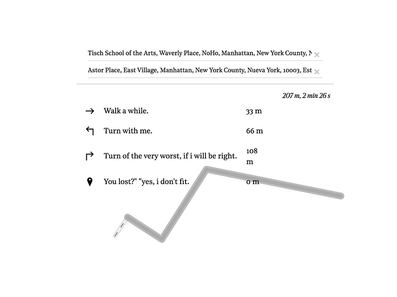

# Turn by Turn

Turn by Turn is an experiment to generate random directions for a given route in a map. The directions are generated using Markov chains with a corpus based on literature and books related to New York City. The seed for each direction is the first two words from the original route.

###### Directions to get from Wall Street to MOMA:


## Process

I like the idea of taking specific elements out of context and placing them in new scenarios. Maps have very specific purposes and most of the time they are very much seen as credible and single sources of true. Although, there's a lot of information and data that is unseen when maps are created. Information and relationships about a city, a place or a town that are impossible to describe in a map.

This project tries to explore those relationships by generating text/poetics/instructions in relationship to a place. In this case, New York.

I started playing with walking routes given by google's routing algorithm. Using the instructions as seed for generative text. Most of the time, this instructions tend to be very specific and clear. Appropriating the algorithmic nature of this instructions was my main goal.


##### LSTM vs Markov Chains

My first approach involved training a LSTM neural network on a source text and then let it decide the set of instructions using the first two or three words in a route as the seed. I used a set of different source texts as the training corpus. My attempts included: all of Shakespeare's work, Kafka, Darwin and a compilation of the most downloaded books in the Gutenberg project. Being this my first time with neural networks, I was seeking an excuse to experiment with this technique rather than finding a specific method to use. After two days of training most of the results I was getting were hard to interpret and reason about. The output was repeatedly using the same words and one of the neural networks was fixated with the word 'state'.
```
Turn left on hide about the state of the state and state of the state state
```

Later I learned that although I was training the network on several epochs, calibrating the batch and the size of the hidden layers is just as important when training. But I think that most important part of why this method didn't work for my purposes, is that I was looking to generate small short lines, rather than a large output. LSTM is better when using and retaining the context of previous words. So, I moved to use Markov Chains.

Markov chains prove to output much more interesting results given the same seed. Plus, this didn't involved training hours! After a couple of experiments I was getting much more compelling outputs:




I decided to build my model using books and novels set in the city I was working with. I compiled a corpus using this books:

- A History of New York - Washington Irving (1809)
- Ragged Dick - Horatio Alger (1868)
- Washington Square - Henry James (1880)
- How the other half life: Studies among the tenements of New York (1890)
- Maggie: A Girl of the Streets - Stephen Crane (1893)
- The House of Mirth - Edith Wharton (1905)
- The Age of Innocence - Edith Wharton (1920)
- The Beautiful and Damned - F. Scott Fitzgerald (1922)
- The Great Gatsby - F. Scott Fitzgerald (1925)
- The Catcher in the Rye - J. D. Salinger (1951)  
- Breakfast at Tiffany's - Truman Capote (1958)
- The New York Trilogy - Paul Auster (1985-86)

## Live Version

[Turn by Turn](http://turnbyturn.3laab.com:4040/)

##### Tools Used

- [Allison Parrish Markov Generator](https://github.com/aparrish/rwet-examples/tree/master/ngrams)
- [Leaflet Routing Machine](https://github.com/perliedman/leaflet-routing-machine)
- [Leaflet + Mapzen Search geocoding plugin](https://github.com/mapzen/leaflet-geocoder)
- [LSTM source from Shiffman's NOC](https://github.com/shiffman/NOC-S17-2-Intelligence-Learning)
- Everything is hosted in flask server

### A note on the files

The current working version is:

`server_markov_simple`

The LSTM version is:

`server`

There's another version with slightly different outcomes using markov in:

`server_markov`

### What next

Maybe work and experiment with word2vec as the method to generate instructions. But adding new cities and source text for each city could be more interesting.
