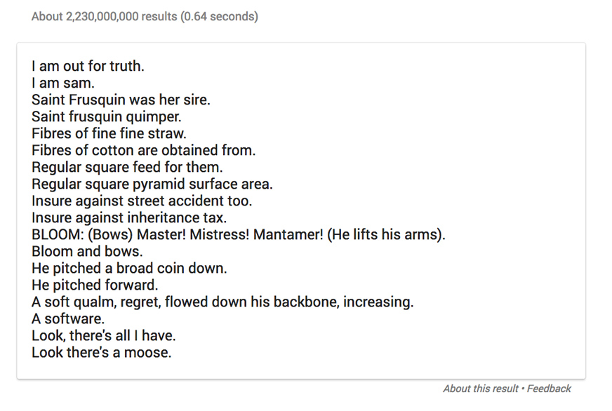

# Google's Autocomplete on Ulysses




This script loads Ulysess by James Joyce from the Gutenberg Project, and selects a random set of sentences. It then performs a Google search, using Google's autocomplete API, on the first two words of each sentence and returns a random result from all the suggested autocomplete sentences.


Input: the first two words of a random set of three sentences.
```
The Irish
His breath,
Many errors,
```
Output: Random suggested autocomplete elements:
```
The irish coffee pub
His breath smells like feces
Many connection errors
```
In part inspired by the terrible idea I had of trying to read this book, and in part inspired by [how bad are Google Snippets in giving prime placement to awful answers.](https://theoutline.com/post/1192/google-s-featured-snippets-are-worse-than-fake-news)


