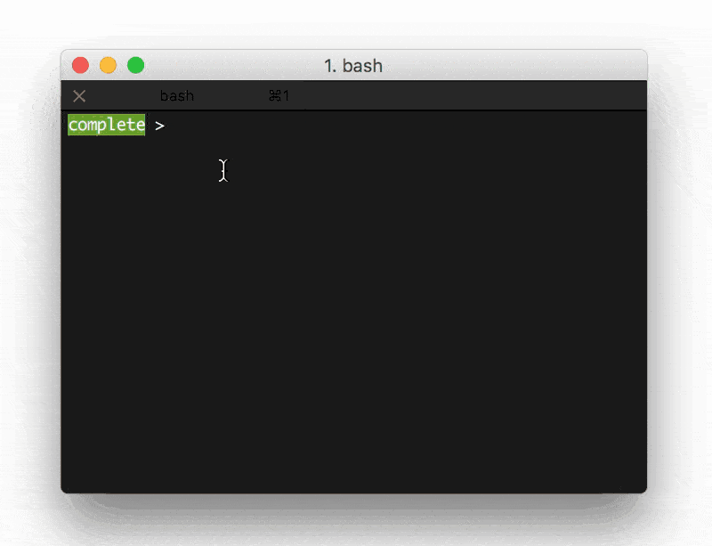

# Google, you autocomplete me

Based on my week 5 assignment on [Google's Autocomplete on Ulysses](../week5) as a module, this script will take up to three or four words, perform a google search and return a list of suggested autocomplete phrases. I'm using the [Python Prompt Toolkit](https://github.com/jonathanslenders/python-prompt-toolkit) and Google's autocomplete API.

Install:

`pip install -r requirements.txt`

`python completme.py`
