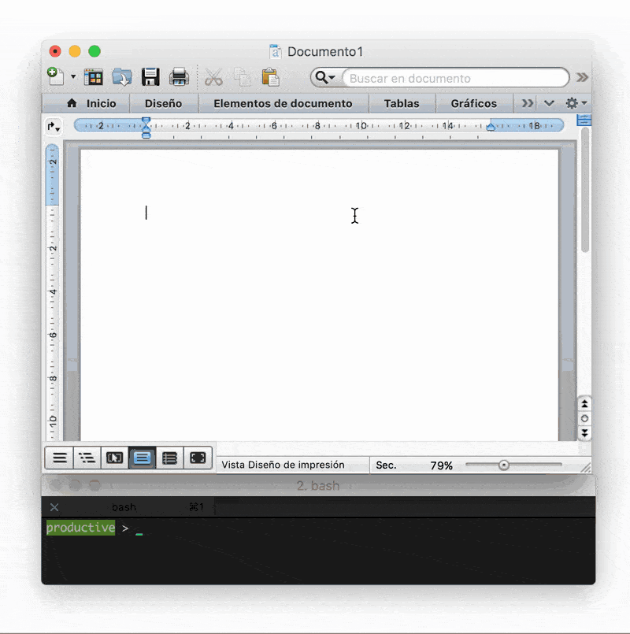

# Being Productive in Microsoft Word

This script allows you to write two word sentences in any Microsoft Word document, and  output a Markov chain text using a model build with the Cornell Supreme Court Dialogs Corpus.

A model is built and then the output is triggered using AppleScript to get and paste the content of the new text.

To be productive:

`python productive.py`

## Data

I am using the [Cornell Supreme Court Dialogs Corpus v1.01](https://confluence.cornell.edu/display/llresearch/Supreme+Court+Dialogs+Corpus): a collection of conversations from the U.S. Supreme Court Oral Arguments. This corpus includes:

- 51,498 utterances making up 50,389 conversational exchanges
- from 204 cases involving 11 Justices and 311 other participants (lawyers or amici curiae)

I run another version using the data from the [Cornell Movie-Quotes Corpus v1.0](http://www.cs.cornell.edu/~cristian/Cornell_Movie-Dialogs_Corpus.html). This corpus contains a collection of movie lines together with memorability annotations. It works in the same way, write two words in a sentence and run the script. It will output a 'kind of movie-script' using markov chains.

The markov models are build using the [markov module](https://github.com/aparrish/rwet-examples/blob/master/ngrams/markov.py) by [aparrish](https://github.com/aparrish).

## Outputs

- Results running the Supreme Court Dialogs Corpus:

  <b>Input:</b> 
  The jury 
  The case 
  Evidence is 
  Sentence has 
  People are

  <b>Output:</b> 
  The jury got to fall back, at 
  The case is not true after Blakely. At best, for him, and 
  Evidence is it not to seek 
  Sentence has work to root out 
  People are treated differently State to solicit members 

- Results running the Movie-Quotes Corpus:

  <b>Input:</b> 
  What was 
  In the 
  I hate 
  Bring me 
  Shoot him 

    <b>Output:</b> 
  What was the law and heck if I’m losin’ you
  In the fruit cellar. Even treated
  I hate about you Watching that bitch in the trunk. Otherwise, you’re
  Bring me their heads, trying to
  Shoot him in the vehicle at all that I
